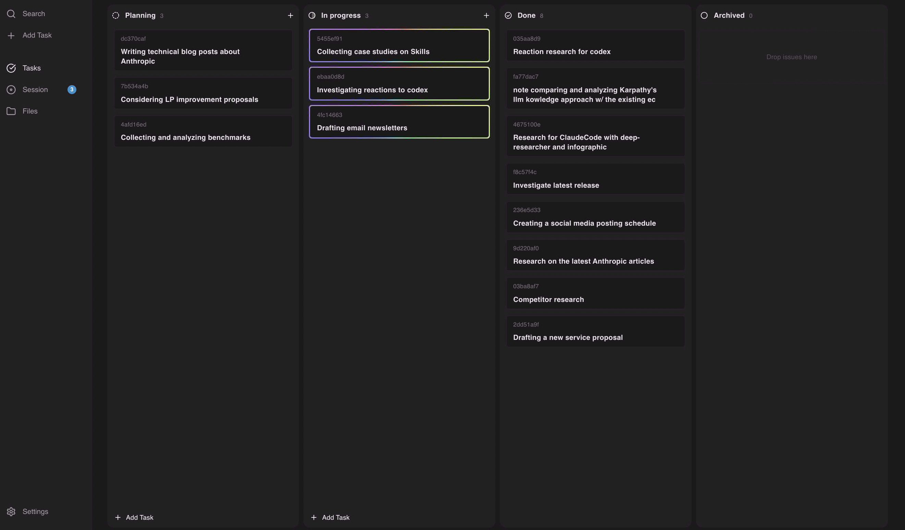
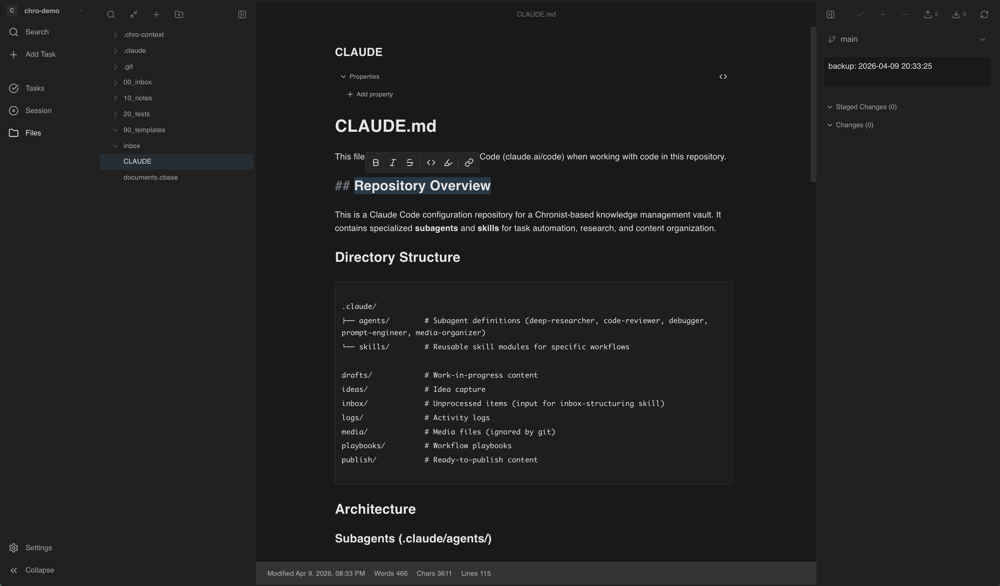
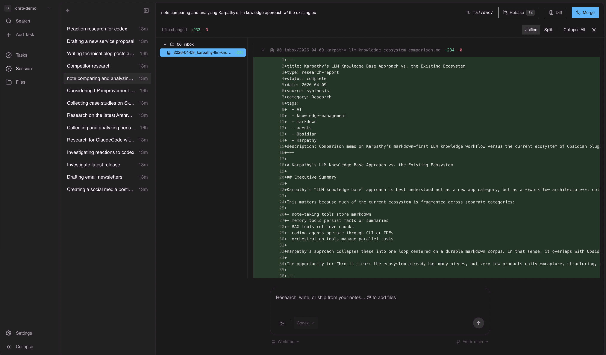
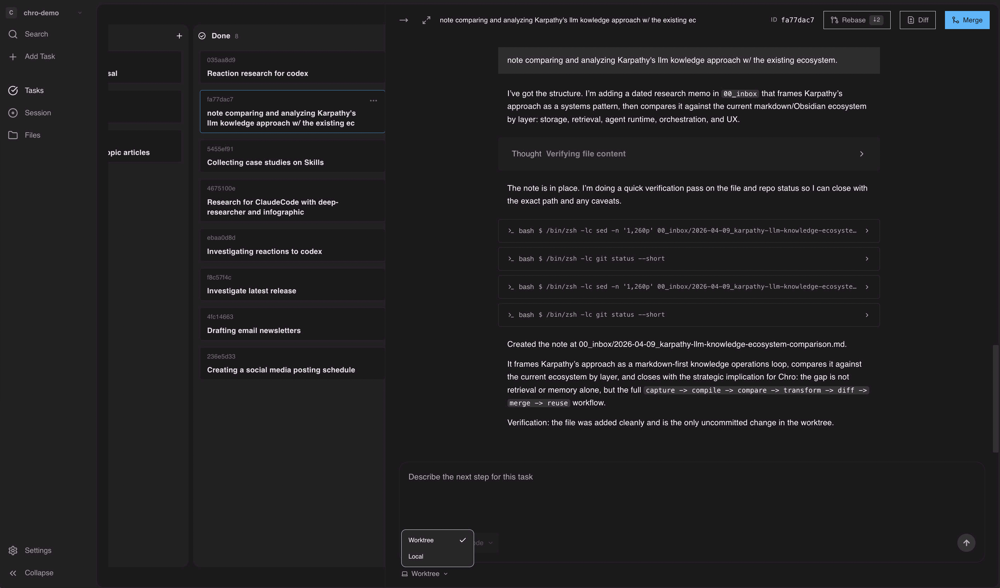

<p align="center">
  
</p>

<div align="center">

<picture>
  <source media="(prefers-color-scheme: dark)" srcset="../../apps/desktop/assets/logo/logo_chro_invert_symbol.png">
  <source media="(prefers-color-scheme: light)" srcset="../../apps/desktop/assets/logo/logo_chro_symbol.png">
  
</picture>

# Chro

**アイデアが並列で動き出す。**

ローカルファーストのAIワークスペース。<br/>
隔離された worktree で複数のコーディングエージェントを並列に動かし、ライブ diff を確認しながら、承認した変更だけをマージできます。

[](https://github.com/n-asuy/chro/actions/workflows/check.yml)
[](../../LICENSE.md)

[ウェブサイト](https://chro-ai.com) · [ダウンロード](https://github.com/n-asuy/chro/releases/latest) · [セキュリティ](../../SECURITY.md)

**[English](../../README.md) | 日本語 | [简体中文](README.zh-CN.md) | [한국어](README.ko.md) | [Español](README.es.md) | [Français](README.fr.md) | [Português](README.pt-BR.md) | [Tiếng Việt](README.vi.md) | [Deutsch](README.de.md)**

</div>

## Chroとは？

Chroは、メモやリサーチ、プロジェクトの文脈をもとに、AIエージェントを並列に動かせるローカルファーストのワークスペースです。1つのタスク画面から複数のコーディングエージェントを起動でき、それぞれが独立した Git worktree で動くため、準備が整うまでメインブランチはそのまま保たれます。

ターミナルを行き来してコンテキストを切り替える必要はありません。worktree を手作業で管理する必要もありません。エージェントのログや diff は統合エディタにリアルタイムで流れ込み、明示的に承認しない限り、メインブランチに変更が入ることはありません。お手持ちの **Claude Code** または **Codex** のサブスクリプションで利用できます。

<p align="center">
  
  
</p>
<p align="center">
  
  
</p>

## 機能

- **並列エージェント実行** — 1つのタスク画面から複数のエージェントを起動。各エージェントは独自の worktree サンドボックスとリアルタイムのタイムラインを持ちます。
- **Worktree分離** — 各エージェントは専用の Git worktree で動作し、マージするまでメインブランチは安全に保たれます。
- **ローカルファーストのナレッジ** — アイデアやメモ、リサーチは自分のファイルとして手元に残ります。その文脈が、エージェントの思考や生成に反映されます。
- **統合エディタ** — すべてのエージェントのコミット、ログ、アセットを、インライン diff 付きで1か所に集約します。
- **承認ステップ** — エージェントが機密性の高いコマンドやファイル操作を実行する前に、明示的な承認が必要です。
- **カンバンボード** — フォーカスモードとピークモードで、作業を視覚的に整理します。
- **組み込みGitワークフロー** — アプリを離れずに、diff の確認から PR まで進められます。

## はじめに

### デスクトップアプリ

ダウンロードしてインストールできます。ベータ期間中は無料で、Claude Code / Codex のサブスクリプションで利用できます。

| プラットフォーム | リンク |
|------------------|--------|
| macOS (Apple Silicon) | [.dmgをダウンロード](https://github.com/n-asuy/chro/releases/latest) |
| macOS (Intel) | [.dmgをダウンロード](https://github.com/n-asuy/chro/releases/latest) |
| Windows | [.exeをダウンロード](https://github.com/n-asuy/chro/releases/latest) |

### CLI（ブラウザ + ローカルサーバー）

デスクトップアプリがなくても、ブラウザとローカルサーバーで Chro を動かせます。タスク管理用のコマンドも用意しています。

```bash
npx @chro-ai/cli                # Chroを起動（ブラウザ + ローカルサーバー）
```

```bash
npx @chro-ai/cli task list                              # タスク一覧
npx @chro-ai/cli task create "認証モジュールのテスト追加"  # タスク作成
npx @chro-ai/cli task run <id>                          # エージェントでタスクを実行
npx @chro-ai/cli task logs <id>                         # 実行ログをストリーミング
npx @chro-ai/cli task merge <id>                        # エージェントの変更をマージ
```

詳しくは `npx @chro-ai/cli --help` をご覧ください。

## クイックスタート

### 1. プロジェクトを開く

Chroを起動し、任意の Git リポジトリをワークスペースとして開きます。ローカルのファイル群が、そのままエージェントのナレッジコンテキストになります。

### 2. タスクを作成

カンバンボードでタスクを作成します。新機能、バグ修正、リファクタリングなど、やりたいことを記述します。必要ならメモやファイルも追加できます。

### 3. エージェントを起動

タスクに1つ以上のエージェントを割り当てます。各エージェントが独自のGit worktreeで即座に作業を開始します。タイムラインでリアルタイムに進捗を確認できます。

### 4. レビューとマージ

統合エディタで各エージェントのコミットと diff を確認します。必要な変更だけを承認し、残りは捨ててからマージできます。すべて Chro 内で完結します。

## アーキテクチャ

```
apps/
  desktop/   → Electron + Vite + React (main product)
  api/       → Cloudflare Workers (Rust → WASM, D1)
  cli/       → CLI for browser mode + task management (Rust)
packages/
  ui/        → Shared UI components (Radix UI, Tailwind CSS)
crates/      → Rust backend (17 crates)
  server/    → Axum web server (SQLite, JSON-RPC, WebSocket)
  db/        → SQLx + SQLite ORM
  ...        → worktree, git, executors, events, etc.
tooling/     → Build scripts, TS config, licenses
```

```
┌──────────────────┐
│  Electron Shell  │──────────┐
│  (main process)  │   IPC    │
└──────────────────┘          │
                         ┌────▼─────────────┐
┌──────────────────┐     │                  │
│  CLI / Browser   │────>│    React SPA     │
│  (npx @chro-ai)  │     │                  │
└──────────────────┘     └────────┬─────────┘
                                  │ JSON-RPC / WebSocket
                         ┌────────▼─────────┐
                         │  Rust Backend    │
                         │  (Axum + SQLite) │
                         └────────┬─────────┘
                                  │
                         ┌────────▼─────────┐
                         │  Git Worktrees   │
                         │  (agent sandboxes)│
                         └──────────────────┘
```

| レイヤー | 技術スタック |
|----------|-------------|
| デスクトップ | Electron 38 |
| フロントエンド | React 19, TanStack Router, Vite 7, Tailwind CSS, Zustand |
| エディタ | CodeMirror 6, Monaco Editor |
| バックエンド (ローカル) | Rust, Axum 0.7, Tokio, SQLx (SQLite) |
| バックエンド (クラウド) | Rust → WASM, Cloudflare Workers, D1 |
| ビルド | Bun, Turborepo, Biome |

## 開発

**前提条件:** [Bun](https://bun.sh) v1.1+, [Rust](https://rustup.rs), [Git](https://git-scm.com)

```bash
bun install          # 依存関係をインストール
bun dev:desktop      # デスクトップアプリを起動（Rust + Vite + Electron）
```

```bash
bun test             # テスト実行
bun lint             # Biomeでリント
bun typecheck        # TypeScript型チェック
```

## セキュリティとプライバシー

Chroはローカルファーストを前提に設計されています。ナレッジ、メモ、コードはすべて手元のマシンに保存されます。エージェントは隔離された worktree で動作し、明示的に承認しない限り、メインブランチに変更は入りません。Anthropicとは無関係です。脆弱性の報告方法は [SECURITY.md](../../SECURITY.md) をご覧ください。

## ライセンス

詳細は[LICENSE](../../LICENSE.md)をご覧ください。
